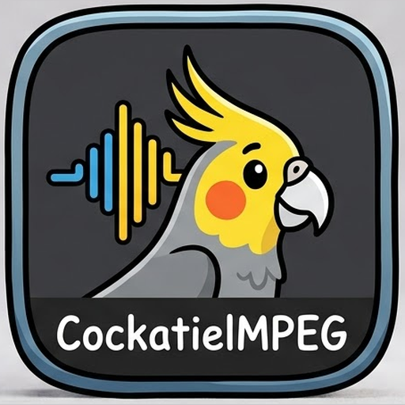

<p align="center">
  
</p>

# 🦜 CockatielMPEG

A simple Android app for putting text on videos with FFmpeg. Pick a file, type your text, tap a button, and watch the result.

**Version:** 0.0.0.1 (first release)

## Features
- Upload a video or image from your phone
- Type text that gets burned onto the video (white text on a dark box, bottom center)
- Images become 5-second videos
- Live FFmpeg log that ends with DONE or FAILED
- Built-in player to watch the result
- Save button that copies the video to `Movies/CockatielMPEG`
- Dark theme

## Requirements
- Android 10 (API 29) or newer

## Install
1. Open the **Actions** tab and open the latest green "Build APK" run.
2. Download the **CockatielMPEG-apk** artifact and unzip it.
3. Allow installs from unknown sources, then open `app-debug.apk`.

## Build it yourself
**GitHub (easiest):** push this project to a repo. The workflow in `.github/workflows/build.yml` builds the APK automatically.

**Android Studio:** open the folder, let Gradle sync, press Run.

**Command line:** with JDK 17, Android SDK and Gradle 8.7+:
```
gradle assembleDebug
```
The APK lands in `app/build/outputs/apk/debug/app-debug.apk`.

## Known bugs
- Early release, so expect rough edges.
- Uses the system Roboto font. If a phone lacks it, rendering fails. Emoji and non-Latin text may show as boxes.
- Long text doesn't wrap and can run off the edges.
- Output uses `mpeg4`, not `h264`, so files are bigger and lower quality.
- Image clips are fixed at 5 seconds with no audio.
- No progress bar and no cancel button while rendering.
- Large videos can be slow or run out of memory.
- Rotating the screen may clear the log and player.
- Old rendered videos stay in cache until Android clears it.

## Planned
- Font, size, color and position options
- Trim, speed and filters
- Custom FFmpeg command box
- Output quality and format options

## Credits
Built with Kotlin, Jetpack Compose, Media3 ExoPlayer and an FFmpegKit fork. FFmpeg is licensed under the LGPL/GPL depending on the build.
